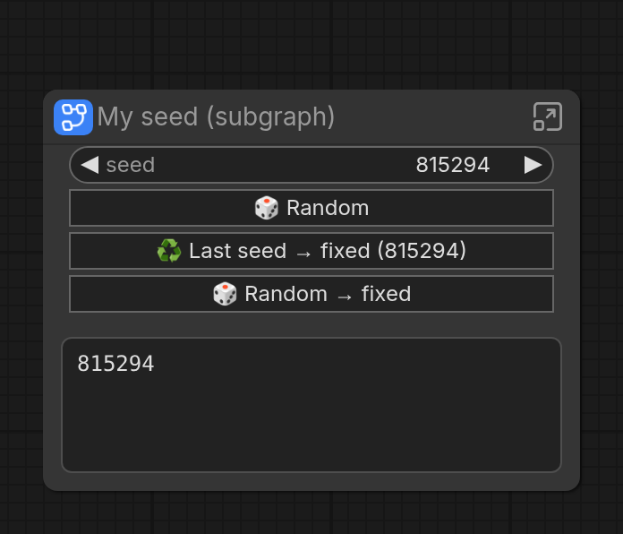
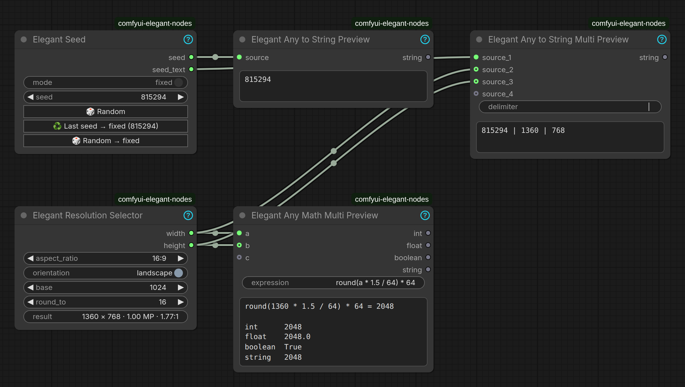
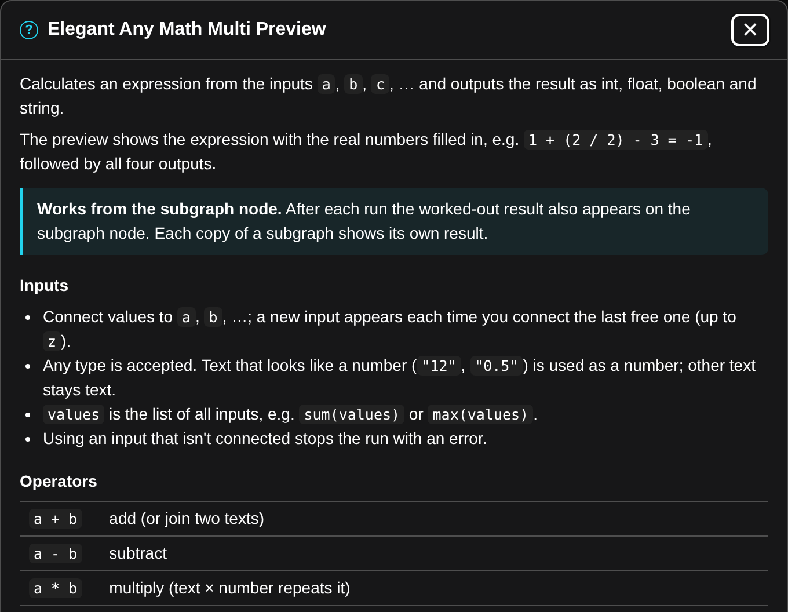

<p align="center">
  
</p>

<h1 align="center">Elegant Nodes for ComfyUI</h1>

<p align="center">
  Small, tidy utility nodes <b>built to work inside subgraphs</b>.
  <br>
  <a href="https://github.com/wipeer/comfyui-elegant-nodes/actions/workflows/tests.yml"></a>
  <a href="LICENSE"></a>
</p>

## Built for subgraphs



Subgraphs are great for packing a workflow into one tidy node, but buttons, live results and
previews usually stay hidden inside, so you keep opening the subgraph to use or check them.
ComfyUI's own Preview as Text, for example, shows nothing on the subgraph node.

**Every Elegant node keeps working from the subgraph node.** The node on the right is a
subgraph holding an Elegant Seed, a Resolution Selector and a Math preview, used without
opening it:

- **Buttons:** 🎲 Random, ♻️ Last seed → fixed and 🎲 Random → fixed act on the subgraph
  node's own seed.
- **Live results:** the resolution result updates as you change the promoted widgets.
- **Previews:** text and math results show on the subgraph node, and their last values are
  saved with the workflow, so they're there right after loading.
- **Every copy** of a subgraph keeps its own seed and shows its own values.

Nothing to set up: promote the widgets you want (ComfyUI promotes `seed` automatically), and
the rest follows. Demote them and it goes away.

<br clear="right">

## The nodes



| Node | What it does | On the subgraph node |
|------|--------------|----------------------|
| [**Elegant Seed**](#elegant-seed) | A seed with a random/fixed switch and buttons to reuse or re-roll it. | Seed buttons, per copy |
| [**Elegant Resolution Selector**](#elegant-resolution-selector) | Width and height from an aspect ratio, keeping the pixel count steady. | Live result |
| [**Elegant Any to String Preview**](#elegant-any-to-string-preview) | Any value as plain text. | Text preview |
| [**Elegant Any to String Multi Preview**](#elegant-any-to-string-multi-preview) | Several values joined as text, or one picked by index (switch). | Text preview |
| [**Elegant Any Math Multi Preview**](#elegant-any-math-multi-preview) | A math expression over any number of inputs, with a worked-out preview. | Worked-out result |
| [**Elegant Load Image (from Folder)**](#elegant-load-image-from-folder) | The images in a folder, optionally filtered (`*train_??5.*`), plus each file's name (or name without extension, or full path). | List of loaded files |
| [**Elegant Random Number**](#elegant-random-number) | A seeded random int or float between min and max: ComfyUI's standard seed plus the seed buttons. | Seed buttons and value, per copy |

All nodes are in the **utilities → elegant** category. Click the cyan **?** in a node's title
for detailed help on that node.

## Installation

**ComfyUI-Manager:** search for **Elegant Nodes** and click *Install*.

**Comfy CLI:**

```bash
comfy node install elegant-nodes
```

**Manually:**

```bash
cd ComfyUI/custom_nodes
git clone https://github.com/wipeer/comfyui-elegant-nodes.git
pip install -r comfyui-elegant-nodes/requirements.txt
```

Restart ComfyUI and refresh the browser.

**Requirements:** ComfyUI 0.4.0 or newer (the nodes use the V3 node API with auto-growing
inputs). The only Python dependency is [simpleeval](https://github.com/danthedeckie/simpleeval),
which ComfyUI already installs.

## Node details

### Elegant Seed

Based on ComfyUI's built-in [Seed](https://github.com/Comfy-Org/ComfyUI/blob/master/comfy_extras/nodes_seed.py) node.

| Control | What it does |
|---------|--------------|
| **mode** | `random`: a new seed for every run. `fixed`: the seed in the field is always used. |
| **seed** | Shows the seed; type one to use it for the next run, in either mode. |
| **🎲 Random** | New seed now, and switch to `random`. |
| **♻️ Last seed → fixed** | Put back the seed of the last **finished** run (the image you see) and switch to `fixed`. The label shows that seed. Runs still queued or generating don't count. |
| **🎲 Random → fixed** | New seed, and switch to `fixed`. |

Outputs: `seed` (INT) and `seed_text` (STRING).

In `random` mode the node follows ComfyUI's setting **Settings → Lite Graph → Node Widget →
Widget control mode**:

- **after** (default): the run uses the seed you see, then a new one appears. To get back the
  seed of an image you liked, use **♻️ Last seed → fixed**.
- **before**: a new seed is made just before the run, so the field shows the seed that was used.

The last seed is saved with the workflow. In a batch, every run gets its own seed and the last
one is remembered. Random seeds go up to 2⁵³ − 1, the largest number the browser handles
exactly (like ComfyUI's own randomize).

**In a subgraph:** `seed` is promoted automatically and the three buttons appear on the subgraph
node. Promote `mode` too to get the switch there; otherwise the switch inside is used.

### Elegant Resolution Selector

| Control | What it does |
|---------|--------------|
| **aspect_ratio** | 1:1, 5:4, 9:7, 4:3, 3:2, 16:9, 21:9. In portrait the list shows them flipped (4:5 … 9:21). |
| **orientation** | `landscape` or `portrait`. No effect at 1:1. |
| **base** | Side of the square image. 1024 gives about 1 MP for every ratio (SDXL, Flux); 512 for SD 1.5. |
| **round_to** | Width and height become multiples of 8, 16 (default), 32 or 64. 16 suits Flux/SD3, 64 matches SDXL training sizes. |
| **result** | Read-only, live: e.g. `1360 × 768 · 1.00 MP · 1.77:1` (ratio after rounding; 1 MP = 1024 × 1024). |

Outputs: `width` and `height` (INT), e.g. into Empty Latent Image.

The size is `width = base × √ratio` and `height = base ÷ √ratio`, each rounded. At base 1024
and round to 16: 1:1 → 1024 × 1024, 4:3 → 1184 × 880, 3:2 → 1248 × 832, 16:9 → 1360 × 768,
21:9 → 1568 × 672.

**In a subgraph:** promote any of its widgets and the result field appears on the subgraph node,
following the promoted values live.

### Elegant Any to String Preview

Turns any value into text, shows it in a plain-text box you can select and copy, and outputs it
as `string`. Uses the same conversion as ComfyUI's
[Preview as Text](https://github.com/Comfy-Org/ComfyUI/blob/master/comfy_extras/nodes_preview_any.py),
without the Markdown mode: text stays as is, numbers and booleans become their value, lists and
dictionaries become indented JSON, and anything else (tensors, latents, …) is printed.

Switch **wrap_text** (an advanced input, off by default) on to wrap long lines to the width of the box instead of scrolling
sideways; the box grows to fit.

**In a subgraph:** after each run the text also appears on the subgraph node, so you can check a
value without opening it. The box is there as soon as the node is inside a subgraph, and the
last text is saved with the workflow, so it shows again right after loading.

### Elegant Any to String Multi Preview

The same for several values: joined with a delimiter (**concat**), or one of them picked by
index (**switch**).

- `source_1`, `source_2`, …: a new input appears each time you connect the last free one (up
  to 20). Disconnect one and the gap closes.
- `delimiter`: concat mode, default `\n` (new line). `\t` is a tab and `\\` a backslash; anything else is
  used as typed, e.g. `, ` or ` | `.
- `wrap_text` (advanced): wrap long lines to the box width, like the single preview.
- `mode`: `concat` joins all sources; `switch` uses only the source chosen by `index`. Only the
  settings the mode uses are shown: `delimiter` (and `prefix` / `suffix` when switched on) in
  concat, `index` in switch. The others move to the [advanced settings](#advanced-settings),
  greyed out.
- `use_prefix` / `use_suffix` (advanced, concat): switch on to show a `prefix` / `suffix` field.
  Its text is added before / after the joined text, with `\n` and `\t` like the delimiter: e.g.
  prefix `Fruits:\n` gives `Fruits:`, `apple`, `banana` on separate lines.
- `index`: switch mode, which source to use, counting from 1 (`source_1`). Connect a number to
  choose it from elsewhere, e.g. an Elegant Random Number for a random pick.
- `out_of_range` (advanced): what an index outside
  the connected sources does: `error` (default) stops with a message, `clamp` uses the first
  source below 1 and the last one above, `wrap` counts around.

Outputs: `string` (the joined text, or the chosen source as text) and `value`: in switch mode the
chosen source **unchanged**, so the switch works for images, models, latents… anything. ComfyUI
still computes every connected source, also the ones not picked.

**In a subgraph:** the joined text appears on the subgraph node, like the single preview. The box
there follows the node's `wrap_text` switch, or the subgraph node's own if you promote it.

### Elegant Any Math Multi Preview

Evaluates an expression over the inputs `a`, `b`, `c`, … and outputs the result as `int`,
`float`, `boolean` and `string`. The preview shows the expression with the real values filled in:

```
1  + (2 / 2) - 3 = -1

int      -1
float    -1.0
boolean  True
string   -1.0
```

- **Inputs** accept any type, and text that looks like a number is used as one. A new input
  appears each time you connect the last free one (up to `z`). `values` is the list of all
  inputs, e.g. `sum(values)`.
- **Operators:** `+ - * / // % **`, `== != < <= > >=`, `and or not`, `x if condition else y`.
- **Functions:** `sum min max abs round pow sqrt ceil floor log log2 log10 exp sin cos tan
  clamp int float str bool`. **Constants:** `pi`, `tau`.
- **Seeded random:** `rand(seed)` (0 to 1), `randint(seed, low, high)`, `uniform(seed, low, high)`.
  The same seed always gives the same number, e.g. `randint(a, 1, 6)` with an Elegant Seed as `a`.
- **Outputs:** `int` cuts decimals off (1.77 → 1; use `round(…)` to round), `boolean` is False
  for 0 or empty text. If the result is text that isn't a number, `int` and `float` are 0.
- **Examples:** `a / b`, `round(a / 64) * 64`, `max(a, b)`, `a * b / 1048576` (megapixels),
  `clamp(a, 1, 150)`, `a % 2 == 0`, `a + "_" + str(b)`.

Expressions are evaluated with [simpleeval](https://github.com/danthedeckie/simpleeval), like
ComfyUI's own Math Expression node: only math, no Python code, and huge powers are refused.
Errors such as division by zero or an unconnected input stop the run with a message.

**In a subgraph:** the worked-out result appears on the subgraph node after each run.

### Elegant Random Number

A random number between **min** and **max** (both included), drawn from a seed: the same seed
always gives the same number, so you can get a value back.

- **seed** is ComfyUI's standard seed, like KSampler's, with its own **control after generate**
  (`fixed`, `increment`, `decrement`, `randomize`). ComfyUI changes it before or after each run,
  per the *Widget control mode* setting.
- **🎲 Random**: new seed now, control set to `randomize`. **♻️ Last seed → fixed**: the seed of
  the last finished run, control set to `fixed`. **🎲 Random → fixed**: new seed, control set to
  `fixed`.
- **number_type**: `int` for a whole number, `float` for a decimal one.
- Outputs `int`, `float` and `string`; the preview shows the value, range and seed.

Connect its `int` to a Multi Preview's `index` in switch mode for a random pick from a list.

**In a subgraph:** `seed` is promoted automatically and the seed buttons appear on the subgraph
node; the value shows there after each run. *control after generate* stays on the node inside
(ComfyUI doesn't promote it), and the buttons set it there.

### Elegant Load Image (from Folder)

ComfyUI's [Load Image (from Folder)](https://github.com/Comfy-Org/ComfyUI/blob/master/comfy_extras/nodes_dataset.py),
plus the file name of each image.

| Control | What it does |
|---------|--------------|
| **folder** | A folder inside ComfyUI's `input` directory. Its images are loaded (PNG, JPG, WEBP, BMP, TIFF). Press **R** to refresh the list after adding one. |
| **filter** | Load only images whose **file name** matches, e.g. `*train_??5.*`: `*` is anything, `?` one character, `[abc]` one of a, b, c. Upper/lower case is ignored. Empty: all images. |
| **include_subfolders** | Advanced (⚙). Also load images in subfolders, at any depth. The filter still matches only the file name. |
| **filename_format** | Advanced (⚙). What `filename` holds: `file name` (`photo.png`, default), `name without extension` (`photo`) or `full path` (the file's path on the ComfyUI server). |

Outputs, both lists in the same order, so the nodes after it run once per image:

- `images`: the images (they may have different sizes).
- `filename`: each image's name, e.g. into a Save Image prefix to keep the original names.

Compared to ComfyUI's node, files load in name order with numbers by value (`img2` before
`img10`; with subfolders, by path inside the folder), camera rotation (EXIF) is applied, and the
node runs again when files in the folder are added, removed or changed. The preview lists the
loaded files, e.g. `3 of 120 images in pets match *train_??5.*`. No matching image stops the run
with a message.

**In a subgraph:** the list of loaded files appears on the subgraph node after each run.

## Advanced settings

Rarely needed settings (`wrap_text`, `out_of_range`, `use_prefix`, `use_suffix`,
`filename_format`, `include_subfolders`, and the Multi Preview settings its mode doesn't use) are advanced inputs, hidden by default. Click
the cyan **⚙** in the node's title to show or hide them, in both the classic and the Vue nodes
view. It uses the node's own "show advanced" state, so it stays in sync with ComfyUI's **Show
advanced inputs** button and the side panel, and it's saved with the workflow.

## Help

Each node has a cyan **?** in its title that opens detailed help, including every operator and
function of the math node.



## Known limitations and plans

See [TODO.md](TODO.md) for what doesn't work yet (mostly ComfyUI limitations, with workarounds)
and ideas for later versions.

## Upgrading from earlier versions

**Elegant Random Number** from 1.3.0 had its own random/fixed `mode` switch; it now uses
ComfyUI's standard seed control. In workflows saved with 1.3.0 its values land in the wrong
fields: delete the node and add it again.

Version 1.0.0 renamed some node ids. Workflows saved with an earlier version show those nodes
as missing; replace them with the new ones:

| Before | Now |
|--------|-----|
| Elegant Resolution (`ElegantResolution`) | Elegant Resolution Selector |
| Elegant Any to String (`ElegantAnyToString`) | Elegant Any to String Preview |
| Elegant Any to String (Advanced) (`ElegantAnyToStringAdvanced`) | Elegant Any to String Multi Preview |

## Development

```
__init__.py        ComfyUI entry point
nodes/             node definitions (V3 schema)
core/              logic without ComfyUI imports (resolution, text, math, random, switch, files)
web/js/            frontend: seed buttons, live result, previews, ⚙ advanced, ? help
tests/             pytest tests for core/
```

Run the tests (they need only `simpleeval` and `pytest`; Node.js enables one extra check):

```bash
pip install -r requirements.txt pytest
pytest tests
```

Releases are published to the [Comfy Registry](https://registry.comfy.org) by GitHub Actions
when the version in `pyproject.toml` changes on `main`.

## License

[MIT](LICENSE)
